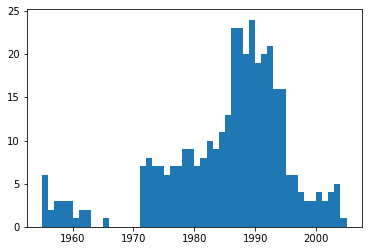
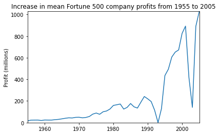
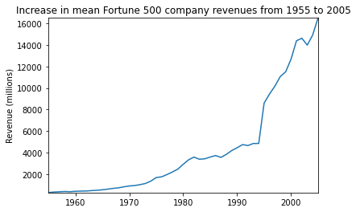
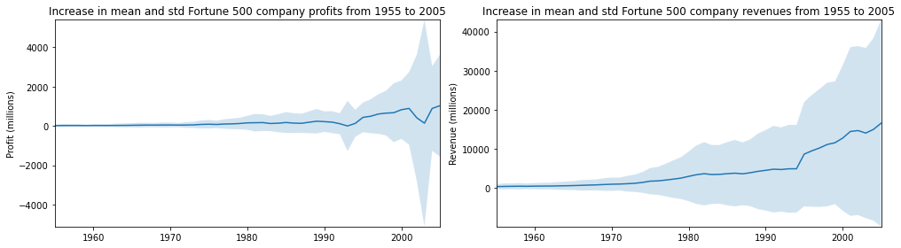

## 实验四：NoteBook的简单实践:

### 一、Cell和Kernel的了解以及简单Python程序的运行：

#### <1>: Cell和Kernel的了解：

    cell: 文本或者代码执行单元，由kernel执行。
    kernel: 计算引擎，执行cell的文本或者代码，本文基于Python 3 ipykernel引擎。
    
    其中，主要包含两种类型的cell：

    代码cell：包含可被kernel执行的代码，执行之后在下方显示输出。
    Markdown cell：书写Markdown标记语言的cell。
    
#### <2>: 简单Python程序的运行：
    


```python
print('Hello World!')
```

    Hello World!
    


```python
import numpy as np
def square(x):
    return x * x
```


```python
x = np.random.randint(1, 10)
y = square(x)
print('%d squared is %d' % (x, y))
```

    7 squared is 49
    

    以上为简单Python程序的运行。
    
### 二、基本Python程序-选排的运行：

#### 编写代码和运行如下：


```python
def selection_sort(arr):
    for i in range(len(arr)-1):
        min_index = i
        for j in range(i+1, len(arr)):
            if arr[j] < arr[min_index]:
                min_index = j
        if i != min_index:
            arr[min_index], arr[i] = arr[i], arr[min_index]
    return arr

arr = [2,3,6,1,0,5,8]
selection_sort(arr)

```


    [0, 1, 2, 3, 5, 6, 8]


### 三、简单数据分析实例：

#### <1>:设置-导入相关库：


```python
%matplotlib inline
import pandas as pd
import matplotlib.pyplot as plt
import seaborn as sns

df = pd.read_csv('fortune500.csv')

df.head()

```


<div>
<style scoped>
    .dataframe tbody tr th:only-of-type {
        vertical-align: middle;
    }

    .dataframe tbody tr th {
        vertical-align: top;
    }

    .dataframe thead th {
        text-align: right;
    }
</style>
<table border="1" class="dataframe">
  <thead>
    <tr style="text-align: right;">
      <th></th>
      <th>Year</th>
      <th>Rank</th>
      <th>Company</th>
      <th>Revenue (in millions)</th>
      <th>Profit (in millions)</th>
    </tr>
  </thead>
  <tbody>
    <tr>
      <th>0</th>
      <td>1955</td>
      <td>1</td>
      <td>General Motors</td>
      <td>9823.5</td>
      <td>806</td>
    </tr>
    <tr>
      <th>1</th>
      <td>1955</td>
      <td>2</td>
      <td>Exxon Mobil</td>
      <td>5661.4</td>
      <td>584.8</td>
    </tr>
    <tr>
      <th>2</th>
      <td>1955</td>
      <td>3</td>
      <td>U.S. Steel</td>
      <td>3250.4</td>
      <td>195.4</td>
    </tr>
    <tr>
      <th>3</th>
      <td>1955</td>
      <td>4</td>
      <td>General Electric</td>
      <td>2959.1</td>
      <td>212.6</td>
    </tr>
    <tr>
      <th>4</th>
      <td>1955</td>
      <td>5</td>
      <td>Esmark</td>
      <td>2510.8</td>
      <td>19.1</td>
    </tr>
  </tbody>
</table>
</div>


```python
df.tail()

```


<div>
<style scoped>
    .dataframe tbody tr th:only-of-type {
        vertical-align: middle;
    }

    .dataframe tbody tr th {
        vertical-align: top;
    }

    .dataframe thead th {
        text-align: right;
    }
</style>
<table border="1" class="dataframe">
  <thead>
    <tr style="text-align: right;">
      <th></th>
      <th>Year</th>
      <th>Rank</th>
      <th>Company</th>
      <th>Revenue (in millions)</th>
      <th>Profit (in millions)</th>
    </tr>
  </thead>
  <tbody>
    <tr>
      <th>25495</th>
      <td>2005</td>
      <td>496</td>
      <td>Wm. Wrigley Jr.</td>
      <td>3648.6</td>
      <td>493</td>
    </tr>
    <tr>
      <th>25496</th>
      <td>2005</td>
      <td>497</td>
      <td>Peabody Energy</td>
      <td>3631.6</td>
      <td>175.4</td>
    </tr>
    <tr>
      <th>25497</th>
      <td>2005</td>
      <td>498</td>
      <td>Wendy's International</td>
      <td>3630.4</td>
      <td>57.8</td>
    </tr>
    <tr>
      <th>25498</th>
      <td>2005</td>
      <td>499</td>
      <td>Kindred Healthcare</td>
      <td>3616.6</td>
      <td>70.6</td>
    </tr>
    <tr>
      <th>25499</th>
      <td>2005</td>
      <td>500</td>
      <td>Cincinnati Financial</td>
      <td>3614.0</td>
      <td>584</td>
    </tr>
  </tbody>
</table>
</div>


```python
df.columns = ['year', 'rank', 'company', 'revenue', 'profit']

```


```python
len(df)

```


    25500


```python
df.dtypes

```


    year         int64
    rank         int64
    company     object
    revenue    float64
    profit      object
    dtype: object


```python
non_numberic_profits = df.profit.str.contains('[^0-9.-]')
df.loc[non_numberic_profits].head()

```


<div>
<style scoped>
    .dataframe tbody tr th:only-of-type {
        vertical-align: middle;
    }

    .dataframe tbody tr th {
        vertical-align: top;
    }

    .dataframe thead th {
        text-align: right;
    }
</style>
<table border="1" class="dataframe">
  <thead>
    <tr style="text-align: right;">
      <th></th>
      <th>year</th>
      <th>rank</th>
      <th>company</th>
      <th>revenue</th>
      <th>profit</th>
    </tr>
  </thead>
  <tbody>
    <tr>
      <th>228</th>
      <td>1955</td>
      <td>229</td>
      <td>Norton</td>
      <td>135.0</td>
      <td>N.A.</td>
    </tr>
    <tr>
      <th>290</th>
      <td>1955</td>
      <td>291</td>
      <td>Schlitz Brewing</td>
      <td>100.0</td>
      <td>N.A.</td>
    </tr>
    <tr>
      <th>294</th>
      <td>1955</td>
      <td>295</td>
      <td>Pacific Vegetable Oil</td>
      <td>97.9</td>
      <td>N.A.</td>
    </tr>
    <tr>
      <th>296</th>
      <td>1955</td>
      <td>297</td>
      <td>Liebmann Breweries</td>
      <td>96.0</td>
      <td>N.A.</td>
    </tr>
    <tr>
      <th>352</th>
      <td>1955</td>
      <td>353</td>
      <td>Minneapolis-Moline</td>
      <td>77.4</td>
      <td>N.A.</td>
    </tr>
  </tbody>
</table>
</div>


```python
len(df.profit[non_numberic_profits])

```


    369


```python
bin_sizes, _, _ = plt.hist(df.year[non_numberic_profits], bins=range(1955, 2006))

```


    

    


```python
df = df.loc[~non_numberic_profits]
df.profit = df.profit.apply(pd.to_numeric)

```


```python
len(df)

```


    25131


```python
df.dtypes

```


    year         int64
    rank         int64
    company     object
    revenue    float64
    profit     float64
    dtype: object


#### 可见，上述操作已经完成了清洗无效数据的效果。

### <2>:使用Matplotlib进行绘图：


```python
group_by_year = df.loc[:, ['year', 'revenue', 'profit']].groupby('year')
avgs = group_by_year.mean()
x = avgs.index
y1 = avgs.profit
def plot(x, y, ax, title, y_label):
    ax.set_title(title)
    ax.set_ylabel(y_label)
    ax.plot(x, y)
    ax.margins(x=0, y=0)

```


```python
fig, ax = plt.subplots()
plot(x, y1, ax, 'Increase in mean Fortune 500 company profits from 1955 to 2005', 'Profit (millions)')

```


    

    


```python
y2 = avgs.revenue
fig, ax = plt.subplots()
plot(x, y2, ax, 'Increase in mean Fortune 500 company revenues from 1955 to 2005', 'Revenue (millions)')

```


    

    


#### 进行标准差处理：


```python
def plot_with_std(x, y, stds, ax, title, y_label):
    ax.fill_between(x, y - stds, y + stds, alpha=0.2)
    plot(x, y, ax, title, y_label)
fig, (ax1, ax2) = plt.subplots(ncols=2)
title = 'Increase in mean and std Fortune 500 company %s from 1955 to 2005'
stds1 = group_by_year.std().profit.values
stds2 = group_by_year.std().revenue.values
plot_with_std(x, y1.values, stds1, ax1, title % 'profits', 'Profit (millions)')
plot_with_std(x, y2.values, stds2, ax2, title % 'revenues', 'Revenue (millions)')
fig.set_size_inches(14, 4)
fig.tight_layout()

```


    

    


#### 可见，不同公司之间的收入和利润差距惊人，那么到底前10%和后10%的公司谁的波动更大了？此外，还有很多有价值的信息值得进一步挖掘。


```python

```


```python

```
### 下载代码补全扩展代码：

    pip install -i https://pypi.tuna.tsinghua.edu.cn/simple/ jupyter_contrib_nbextensions

jupyter contrib nbextension install --user

pip install -i https://pypi.tuna.tsinghua.edu.cn/simple/ jupyter_nbextensions_configurator

jupyter nbextensions_configurator enable --user


#### 在Anaconda cmd.exe中输入以上命令，等待下载完成，即可在notebook的Nbextensions处勾选Hinterland选项完成代码补全插件的启用。

```python

```
